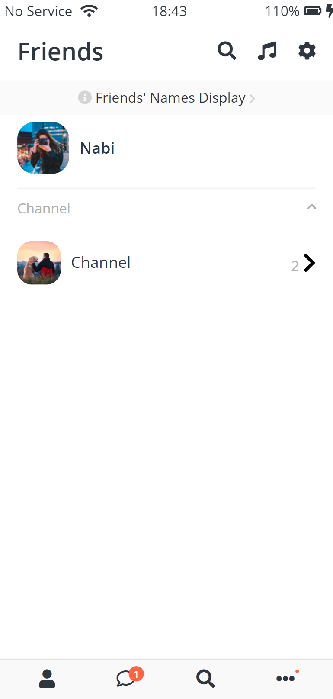

# HTML, CSS Practice - Chatting App Screen Clone

Kokoa clone coding from nomad coder

## Screens

### 1. 로그인 페이지

ID, PASSWORD는 input 태그 required로 필수 입력

### 2. 친구 목록 페이지

### 3. 채팅 리스트

### 4. 채팅룸

### 5. 친구 찾기, 오픈채팅

### 6. 메뉴, 어플 추천

### 7. 설정

